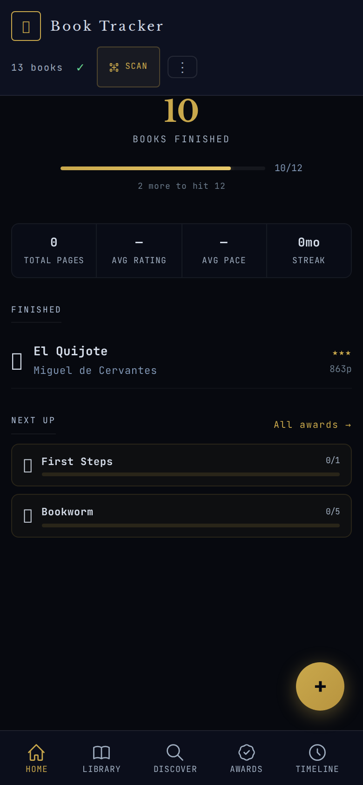
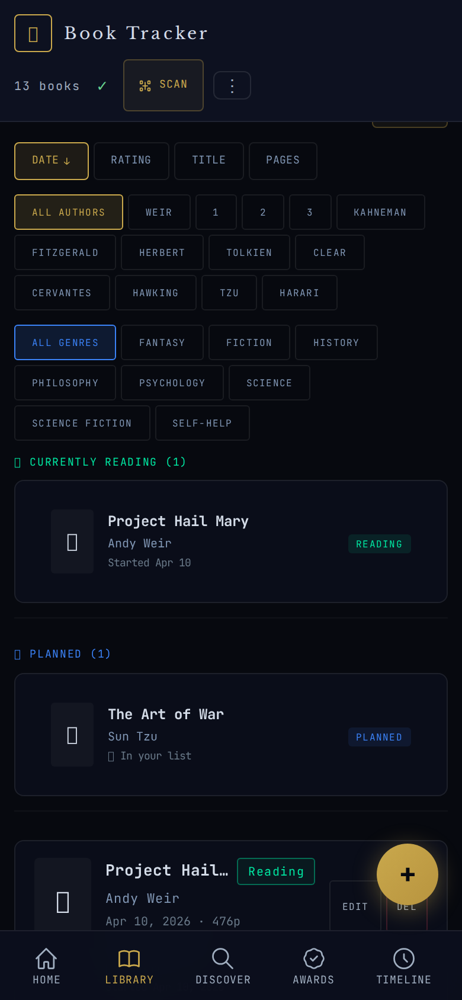
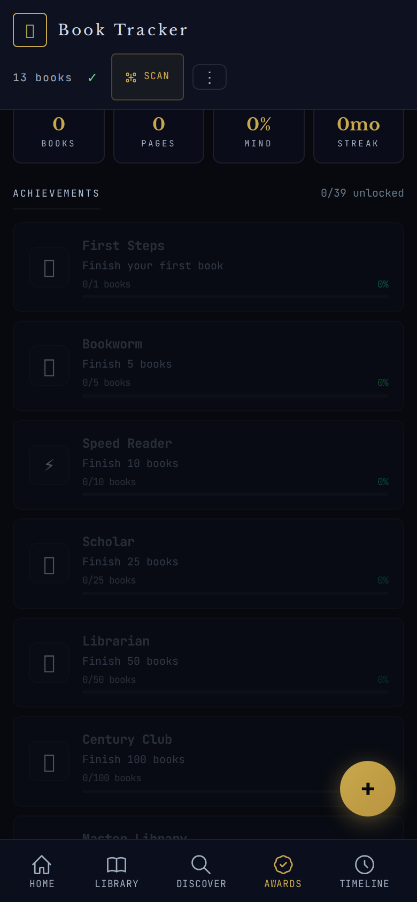
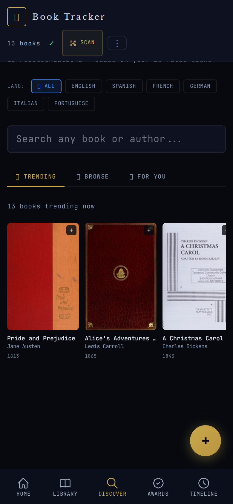
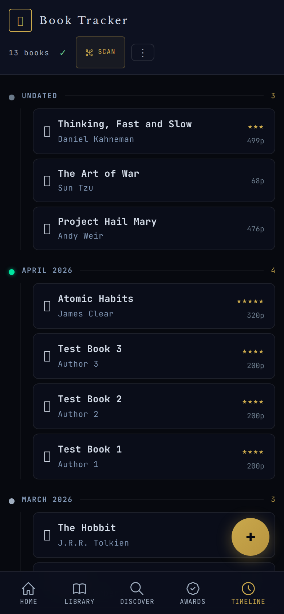
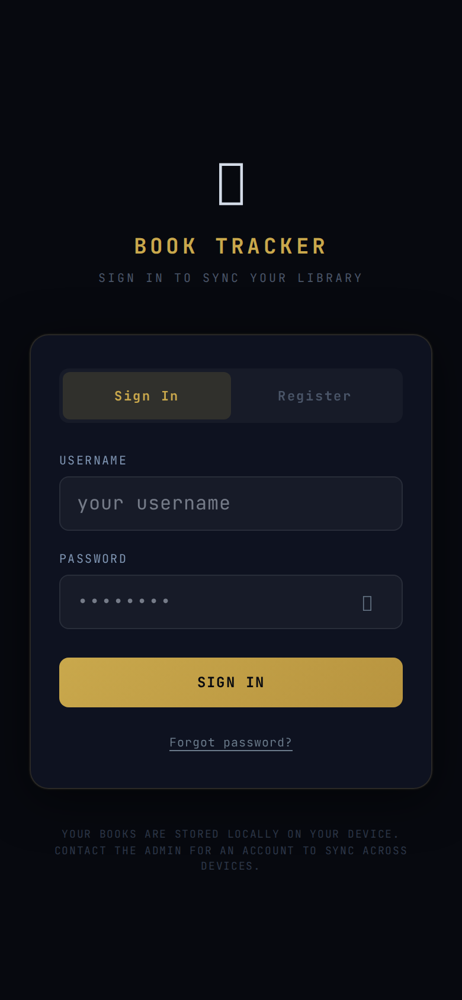

<div align="center">

# 📚 Book Tracker

**A self-hosted book tracking PWA for Home Assistant**

Track your reading, scan barcodes, unlock achievements, and visualize your reading journey.

[](https://my.home-assistant.io/redirect/supervisor_addon/?addon=book_tracker)
[](LICENSE)
[](https://github.com/jsr1292/book-tracker-ha/pkgs/container/book-tracker)

</div>

---

## ✨ Features

### 📖 Library Management
- Add books manually or scan barcodes with your camera
- Track reading status: Reading, Finished, Abandoned, Planned
- Rate books (1–5 stars), record pages, genre, language, dates
- Add personal notes per book
- Search, filter, and sort your collection

### 📊 Statistics Dashboard
- Books finished, total pages, reading streaks
- Average pace (pages/day), average rating
- Genre distribution charts
- Reading goal progress tracking
- Mind sharpness score (gamified)

### 🏆 35 Achievements
Unlock milestones as you read:
- **Books**: First Steps → Bookworm → Scholar → Librarian → Century Club → Master Library
- **Pages**: Page Turner → Marathon Reader → Bookshelf Builder → Page Mountain → Page Summit
- **Streaks**: Streak Starter → Consistent Reader → On Fire → Unstoppable
- **Ratings**: Rating Enthusiast → Critic → Top Score (5★) → Tough Judge (1★)
- **Diversity**: Genre Explorer → Genre Master → Genre Legend → Polyglot
- **Genre-specific**: Fantasy Fan, Science Nerd, History Buff, Thriller Addict, Sci-Fi Voyager, and more
- **Pace & Size**: Lightning (speed read), Slow Burn, Long Haul, Short & Sweet, Tome Crusher
- **Engagement**: Note Taker

### 🔍 Discover
- Personalized recommendations based on your reading history
- Trending books, genre exploration, author-based suggestions
- Powered by Open Library and Google Books

### 📅 Reading Timeline
- Visual timeline of your reading journey grouped by month
- See all finished books chronologically

### 🔐 Security
- JWT-based authentication with 7-day tokens
- Rate limiting (5 login attempts/min)
- Configurable registration (disabled by default)
- Admin user creation endpoint for inviting users
- HTTPS support via reverse proxy

### 📱 PWA
- Install on your home screen like a native app
- Offline support with service worker caching
- Mobile-first design, dark theme
- Barcode scanner using device camera

---

## 📸 Screenshots

| Dashboard | Library | Awards |
|:-:|:-:|:-:|
|  |  |  |

| Discover | Timeline | Login |
|:-:|:-:|:-:|
|  |  |  |

---

## 🚀 Installation

### Add to Home Assistant

1. Go to **Settings → Add-ons → Add-on Store**
2. Click **⋮** → **Repositories**
3. Add: `https://github.com/jsr1292/book-tracker-ha`
4. Find **Book Tracker** → Click **Install**
5. Click **Start**
6. Access via the sidebar or **Open UI**

### With Nginx Proxy Manager (public access)

1. Set up a DuckDNS domain pointing to your HA IP
2. Create a proxy host in NPM forwarding to your HA addon
3. Enable SSL via Let's Encrypt
4. Add the domain to CORS origins in the addon config

---

## ⚙️ Configuration

| Option | Type | Default | Description |
|--------|------|---------|-------------|
| `registration_enabled` | bool | `false` | Allow public user registration |
| `admin_key` | string | `""` | Secret key for admin user creation |

### Creating Users

When registration is disabled (default), create users via the admin endpoint:

```bash
curl -X POST http://your-ha-ip:8099/api/admin/create-user \
  -H "Content-Type: application/json" \
  -d '{"adminKey":"your-secret-key","username":"friend","password":"their-password"}'
```

Set `admin_key` in the addon configuration first.

---

## 🛠️ Tech Stack

- **Frontend:** React + TypeScript, Vite, Tailwind CSS, Workbox (PWA)
- **Backend:** Express.js, better-sqlite3, JWT auth
- **Database:** SQLite (persistent via HA `/data` volume)
- **Build:** Multi-arch Docker images (amd64, arm64, arm/v7)
- **Scanning:** @ericblade/quagga2 (bundled, no CDN)
- **Book data:** Open Library API + Google Books API

---

## 🏗️ Development

```bash
# Clone
git clone https://github.com/jsr1292/book-tracker-ha.git
cd book-tracker-ha

# Install dependencies
cd api && npm install
cd ../client && npm install

# Start API (dev mode)
cd api && REGISTRATION_ENABLED=true JWT_SECRET=dev node --import tsx src/index.ts

# Start client (dev mode, proxies /api to backend)
cd client && npm run dev

# Build for production
cd client && npm run build
cd ../api && npm run build
```

---

## 📁 Data Persistence

The addon stores all data in `/data/database.sqlite`. This volume is preserved across addon updates and restarts. Your books and account survive rebuilds.

---

## 📄 License

MIT License — see [LICENSE](LICENSE) for details.
